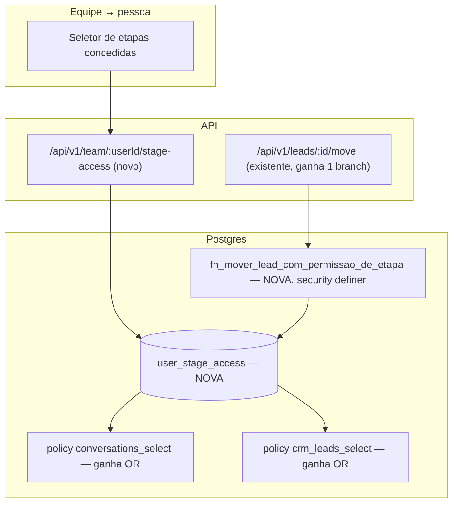

# Acesso por etapa do funil (Design)

**Spec:** `.specs/features/acesso-por-etapa-do-funil/spec.md`
**Status:** Draft

---

## Architecture Overview

Uma tabela nova (`user_stage_access`) + duas extensões pontuais de RLS (nas policies de SELECT de `conversations` e `crm_leads`, nunca nas funções `fn_can_view_conversation`/`fn_can_view_lead` em si) + uma função `security definer` nova para a única ação de escrita que precisa saber "isto era visível ANTES da mudança" (mover um lead pra fora da etapa concedida).



### Por que a mudança NÃO entra dentro de `fn_can_view_conversation`/`fn_can_view_lead`

Essas duas funções são chamadas em **8 lugares fora das policies de SELECT** que este design não deve alterar: outras RLS (`ai_reply_drafts`), triggers de validação de conversa (`supabase/baseline.sql:20059`), resolução de canal de saída (`:21547`), lock de drafts (`:21682`, `:21731`). Mudar a ASSINATURA dessas funções (adicionar um parâmetro de etapa) obrigaria a atualizar todos esses call sites — risco e escopo desnecessários para o que a spec pede. Em vez disso, o acesso por etapa entra como um `OR` adicional **só nas duas policies de SELECT** (`conversations_select`, `crm_leads_select`), usando uma função NOVA e pequena, que não existia antes e portanto não tem call site nenhum para quebrar.

### Por que a escrita (mover o card) NÃO pode ser um `OR` na policy `crm_leads_update`

Medido nesta conversa, lendo a policy real (`supabase/baseline.sql:5752-5765`): `crm_leads_update` tem `USING` e `WITH CHECK` **idênticos**, e os dois avaliam `fn_can_view_lead(organization_id, owner_user_id)` — o `USING` contra a linha ANTES do update, o `WITH CHECK` contra a linha DEPOIS. Hoje isso nunca importa porque mover de etapa não muda `owner_user_id`. Mas o acesso por etapa é **sobre a etapa**, que MUDA exatamente na ação que o P3 da spec exige (o técnico tira o card da etapa dele). Se o `OR` de acesso-por-etapa entrasse em `WITH CHECK` do mesmo jeito, o Postgres validaria a etapa NOVA — que por definição não está mais concedida ao técnico — e a UPDATE inteira seria recusada pelo RLS, travando exatamente a ação que a feature existe pra permitir.

A saída: uma função `security definer` nova, `fn_mover_lead_com_permissao_de_etapa`, que decide a autorização em código PL/pgSQL (onde dá pra olhar o valor ANTIGO antes de aplicar o UPDATE) em vez de deixar a decisão pro par declarativo `USING`/`WITH CHECK`. A rota `app/api/v1/leads/[id]/move/route.ts` passa a chamar essa função via `supabase.rpc(...)` em vez de `.from("crm_leads").update(...)` diretamente — para TODOS os usuários, não só quem tem acesso por etapa, porque a função replica exatamente a regra de hoje (dono OU manager/admin) como um dos ramos, então não muda nada pra quem já podia mover.

---

## Data Model

**Migration nova** (`supabase/migrations/<timestamp>_0234_acesso_por_etapa.sql`, seguindo 0233) + apêndice idempotente no `supabase/baseline.sql` + linha no `MANIFEST.md`.

```sql
create table if not exists public.user_stage_access (
  id uuid primary key default gen_random_uuid(),
  organization_id uuid not null references public.organizations(id) on delete cascade,
  user_id uuid not null references auth.users(id) on delete cascade,
  stage_id uuid not null references public.crm_stages(id) on delete cascade,
  granted_by uuid not null references auth.users(id),
  created_at timestamptz not null default now(),
  unique (user_id, stage_id)
);

create index if not exists user_stage_access_org_stage_idx
  on public.user_stage_access (organization_id, stage_id);
create index if not exists user_stage_access_user_idx
  on public.user_stage_access (user_id);

alter table public.user_stage_access enable row level security;

-- Quem gerencia (lê/escreve) é manager/admin da própria org — mesma régua de
-- `user_organizations`. Quem TEM a concessão não precisa ler esta tabela
-- diretamente: o efeito dela aparece via conversations_select/crm_leads_select.
create policy "user_stage_access_all" on public.user_stage_access
  for all using (
    public.fn_is_platform_admin()
    or (organization_id in (select public.fn_user_org_ids())
        and public.fn_role_at_least(organization_id, 'manager'))
  ) with check (
    public.fn_is_platform_admin()
    or (organization_id in (select public.fn_user_org_ids())
        and public.fn_role_at_least(organization_id, 'manager'))
  );

revoke all on function public.fn_is_platform_admin() from public; -- no-op, já revogado; documenta a intenção
```

Nullable em lugar nenhum de propósito: uma linha só existe quando há concessão. Apagar a linha = revogar. `on delete cascade` nas três FKs: apagar a organização, o usuário ou a etapa limpa a concessão sozinha (sem lead-limbo).

**Função de leitura (auxiliar, `stable`, sem `security definer` — só lê o que a RLS de `user_stage_access` já deixaria o próprio manager ler, mas aqui é chamada pelo AGENTE dentro de outra policy, então precisa bypassar a RLS de `user_stage_access` — daí SIM precisa ser `security definer`):**

```sql
create or replace function public.fn_has_stage_access(p_org uuid, p_stage_id uuid)
returns boolean
language sql stable security definer
set search_path = public
as $$
  select exists (
    select 1 from public.user_stage_access a
    where a.organization_id = p_org
      and a.stage_id = p_stage_id
      and a.user_id = auth.uid()
  );
$$;
revoke all on function public.fn_has_stage_access(uuid, uuid) from public, anon;
grant execute on function public.fn_has_stage_access(uuid, uuid) to authenticated, service_role;
```

**Função para `crm_leads_select` (stage_id é coluna direta da linha — sem join):** usa `fn_has_stage_access` direto.

**Função para `conversations_select` (contact_id → crm_leads.stage_id, indireto, 1:N):**

```sql
create or replace function public.fn_has_stage_access_via_contact(p_org uuid, p_contact_id uuid)
returns boolean
language sql stable security definer
set search_path = public
as $$
  select exists (
    select 1
      from public.crm_leads l
      join public.user_stage_access a
        on a.stage_id = l.stage_id and a.organization_id = l.organization_id
     where l.organization_id = p_org
       and l.contact_id = p_contact_id
       and a.user_id = auth.uid()
  );
$$;
revoke all on function public.fn_has_stage_access_via_contact(uuid, uuid) from public, anon;
grant execute on function public.fn_has_stage_access_via_contact(uuid, uuid) to authenticated, service_role;
```

Satisfaz a AC4 do P2 (contato com mais de um lead: `exists` sem `limit 1` em lead específico — qualquer lead do contato numa etapa concedida libera).

**Policies alteradas (idempotente = `drop policy if exists` + `create policy`, que é o padrão real deste arquivo — `CREATE POLICY IF NOT EXISTS` NÃO é sintaxe válida em Postgres, confirmado nesta mesma conversa ao corrigir um erro idêntico com `ADD CONSTRAINT IF NOT EXISTS`):**

```sql
drop policy if exists "conversations_select" on public.conversations;
create policy "conversations_select" on public.conversations
  for select using (
    public.fn_can_view_conversation(organization_id, assigned_to_user_id)
    or public.fn_has_stage_access_via_contact(organization_id, contact_id)
  );

drop policy if exists "crm_leads_select" on public.crm_leads;
create policy "crm_leads_select" on public.crm_leads
  for select using (
    public.fn_can_view_lead(organization_id, owner_user_id)
    or public.fn_has_stage_access(organization_id, stage_id)
  );
```

**A função de mover (substitui o UPDATE direto da rota, só para o caminho de escrita):**

```sql
create or replace function public.fn_mover_lead_com_permissao_de_etapa(
  p_lead_id uuid,
  p_stage_id uuid,
  p_position_in_stage numeric,
  p_expected_updated_at timestamptz
) returns public.crm_leads
language plpgsql security definer
set search_path = public
as $$
declare
  v_lead public.crm_leads;
  v_new_stage public.crm_stages;
  v_pode boolean;
begin
  select * into v_lead from public.crm_leads where id = p_lead_id for update;
  if not found then
    raise exception 'lead_nao_encontrado' using errcode = 'P0002';
  end if;

  if v_lead.organization_id not in (select public.fn_user_org_ids()) then
    raise exception 'sem_acesso_a_organizacao' using errcode = '42501';
  end if;
  if not public.fn_role_at_least(v_lead.organization_id, 'agent') then
    raise exception 'papel_insuficiente' using errcode = '42501';
  end if;

  -- A MESMA regra de hoje (dono OU manager/admin) OR a concessão por etapa,
  -- avaliada sobre a etapa ANTIGA (v_lead.stage_id) — é isto que o par
  -- declarativo USING/WITH CHECK não conseguiria fazer sem travar a saída.
  v_pode := public.fn_role_at_least(v_lead.organization_id, 'manager')
    or public.fn_can_view_lead(v_lead.organization_id, v_lead.owner_user_id)
    or public.fn_has_stage_access(v_lead.organization_id, v_lead.stage_id);
  if not v_pode then
    raise exception 'sem_permissao_para_mover_este_lead' using errcode = '42501';
  end if;

  select * into v_new_stage from public.crm_stages where id = p_stage_id;
  if not found then
    raise exception 'etapa_nao_encontrada' using errcode = 'P0002';
  end if;
  if v_new_stage.pipeline_id <> v_lead.pipeline_id then
    raise exception 'pipeline_immutable_use_clone' using errcode = '22023';
  end if;

  update public.crm_leads
     set stage_id = p_stage_id,
         position_in_stage = p_position_in_stage,
         updated_at = now()
   where id = p_lead_id
     and updated_at = p_expected_updated_at
  returning * into v_lead;

  if not found then
    raise exception 'lead_stage_changed_concurrent' using errcode = '55P02';
  end if;

  return v_lead;
end;
$$;

revoke all on function public.fn_mover_lead_com_permissao_de_etapa(uuid, uuid, numeric, timestamptz) from public, anon;
grant execute on function public.fn_mover_lead_com_permissao_de_etapa(uuid, uuid, numeric, timestamptz) to authenticated, service_role;
```

`errcode` escolhidos para o handler TypeScript já saber traduzir sem depender de `raise exception`'s mensagem (que não é estável para `catch`): `P0002` = not found (já usado em outros lugares do baseline, ex. `connection_reservation_missing`), `42501` = permissão, `22023` = dado inválido, `55P02` = lock/concorrência — todos códigos SQLSTATE padrão do Postgres, não inventados.

---

## Changes by File

| Arquivo | Mudança |
| --- | --- |
| `supabase/migrations/<timestamp>_0234_*.sql` + `baseline.sql` + `MANIFEST.md` | Tabela `user_stage_access`, as 3 funções novas, as 2 policies de SELECT alteradas (tripla). |
| `lib/schemas/settings.ts` (ou novo `lib/schemas/stage-access.ts`) | Zod: `stageAccessSetSchema = z.object({ stage_ids: z.array(z.string().uuid()) })` — a rota SUBSTITUI o conjunto inteiro de concessões do usuário (mais simples de UI do que add/remove individual). |
| `app/api/v1/team/[userId]/stage-access/route.ts` **(criar)** | `GET` devolve as etapas concedidas hoje; `PUT` substitui pelo conjunto enviado (`requireRole("manager")`, valida que `userId` pertence à mesma org via `user_organizations`, valida que cada `stage_id` pertence a um pipeline da própria org antes de gravar — nunca aceitar stage de outra org). Audit: `team.stage_access_updated`. |
| `app/api/v1/leads/[id]/move/route.ts` | Troca o bloco do `.from("crm_leads").update(...)` (linhas 92-103 hoje) por `supabase.rpc("fn_mover_lead_com_permissao_de_etapa", {...})`; mapeia os `errcode`/mensagens da função para os mesmos códigos de erro HTTP que a rota já usa hoje (`not_found`, `lead_stage_changed_concurrent`, `pipeline_immutable_use_clone`, e um novo `forbidden_stage_move` para `sem_permissao_para_mover_este_lead`). O resto da rota (busca da etapa de destino para o nome, `emitLeadActivity`, `emit_event`, `audit`) **não muda** — só troca COMO o UPDATE acontece. |
| `app/app/team/_components/TeamMembersClient.tsx` | Cada linha da tabela ganha um botão "Acesso por etapa" (só visível se `podeEditar`/manager+) que abre um diálogo listando as etapas do(s) pipeline(s) da org com checkbox, chamando `GET`/`PUT` da rota nova. |
| `lib/audit/actions.ts` | Nova ação `team.stage_access_updated`. |

---

## Error Handling

- `PUT /api/v1/team/:userId/stage-access` com um `stage_id` de outra organização → 422, nomeando o campo (mesma doutrina de erro "não confiar no cliente para escopo" — o `organization_id` do stage é conferido no servidor, nunca aceito do body).
- `POST /api/v1/leads/:id/move` chamando a função nova: cada `errcode` do Postgres vira um código de erro já existente na doutrina de erros da API (`lib/api/errors.ts`) — nenhuma mensagem crua de Postgres chega ao usuário final.
- Sem concessão nenhuma para ninguém: zero mudança de comportamento (testado explicitamente no plano — ver Testing Plan).

## Testing Plan

1. **Invariante de RLS (obrigatório, `pnpm test:db`):** dois usuários `agent` na mesma org, nenhum é dono do lead, nenhum é manager. Sem concessão, nenhum vê a conversa/o card. Conceder a etapa X a um deles: ele passa a ver; o outro continua sem ver. Mover o lead pra etapa Y (não concedida): ele deixa de ver.
2. **Isolamento entre organizações:** concessão de etapa na org A não pode dar acesso a um lead de mesmo `stage_id` (coincidência de UUID é impossível, mas o teste prova que o `join`/`exists` sempre filtra por `organization_id`, nunca só por `stage_id`).
3. **P3 (o motivo desta função existir):** sabotagem deliberada — trocar a chamada da rota de volta para `.update()` direto e prov r que o teste de "técnico move o card pra fora da etapa dele" fica vermelho (RLS recusa o `WITH CHECK`). Reverter e confirmar verde. Isso é o que prova que a função `security definer` era necessária, não decoração.
4. **Regressão:** toda a suíte de invariantes de atribuição/visibilidade já existente (`tests/invariants/*`) continua verde sem nenhuma concessão cadastrada — prova que o `OR` novo é estritamente aditivo.
5. **Unit:** schema Zod da rota de concessão; handler da rota de concessão rejeita `stage_id` de outra org (mock).
