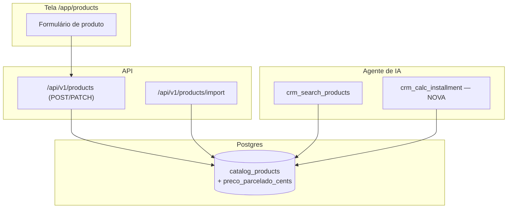

# Catálogo — Preço parcelado e moeda por produto (Design)

**Spec:** `.specs/features/catalogo-parcelamento-e-moeda/spec.md`
**Status:** Draft

---

## Architecture Overview

Nada de subsistema novo: é uma coluna nova (`preco_parcelado_cents`) numa tabela que já existe (`catalog_products`), e a **remoção de uma trava** que hoje força toda linha a nascer na moeda da organização — a coluna `moeda` já existe na tabela, só não é escolhível pela tela nem pelo `POST`.

O cálculo da parcela é feito por uma **ferramenta MCP nova e determinística** (código, não o modelo fazendo conta), pela mesma razão que `formatCents` existe: dinheiro errado por aproximação do LLM é o defeito que este projeto trata como caro (`CLAUDE.md`, doutrina de preço).



---

## Data Model

**Migration nova** (`supabase/migrations/<timestamp>_0233_catalog_preco_parcelado.sql`, seguindo 0232) + apêndice idempotente no `supabase/baseline.sql` + linha no `MANIFEST.md` (tripla obrigatória, `CLAUDE.md`):

```sql
alter table public.catalog_products
  add column if not exists preco_parcelado_cents integer;

alter table public.catalog_products
  add constraint if not exists catalog_products_preco_parcelado_nao_negativo
  check (preco_parcelado_cents is null or preco_parcelado_cents >= 0);
```

Nullable, sem default: produto existente continua sem parcelamento até alguém preencher. Não quebra `update.sh` em instalação já rodando (coluna nova opcional, sem backfill).

`moeda` **não** ganha coluna nova — já existe desde a migration 0208. O que muda é o código que hoje força `moedaDaOrganizacao()` em toda escrita.

---

## Changes by File

| Arquivo | Mudança |
| --- | --- |
| `supabase/migrations/<timestamp>_0233_*.sql` + `baseline.sql` + `MANIFEST.md` | Coluna `preco_parcelado_cents` (tripla). |
| `lib/schemas/produtos.ts` | `produtoCreateSchema` ganha `preco_parcelado_cents: z.number().int().min(0).nullable().optional()` **e** `moeda: z.enum(MOEDAS_SERVIDAS).optional()` (deixa de ser proibido; ausente = cai no comportamento atual). `COLUNAS_DO_PRODUTO` ganha a coluna nova. |
| `lib/money.ts` | `MOEDAS_SERVIDAS` ganha `"GBP"` e `"EUR"`. Nenhuma outra função muda — `formatCents`/`Intl.NumberFormat` já são agnósticos de moeda. |
| `app/api/v1/products/route.ts` | `POST`: se `parsed.data.moeda` vier, usa; senão, `moedaDaOrganizacao()` (fallback atual, sem regressão). |
| `app/app/products/_client.tsx` | Formulário ganha campo "Preço parcelado (opcional)" (mesmo padrão do "Custo") e um `<select>` de moeda pré-marcado com a moeda da organização (vem por prop do server component `page.tsx`). Lista de produtos mostra o preço parcelado quando existir. |
| `app/app/settings/tenant/_form.tsx` | Nenhuma mudança de lógica — só se beneficia do `MOEDAS_SERVIDAS` maior (Libra/Euro aparecem no mesmo seletor). |
| `lib/catalogo/planilha.ts` | `ALIASES` ganha `preco_parcelado: ["preco parcelado", "preço parcelado", "parcelado", "valor parcelado"]` — coluna opcional, mesmo tratamento de `custo` (não entra em `faltando`). Coluna de moeda por linha fica **fora de escopo** (planilha continua usando a moeda da organização; consistente com Out of Scope). |
| `lib/mcp/tools/comercio.ts` | `crmSearchProducts` (`crm_search_products`) passa a devolver `preco_parcelado` (formatado) e `preco_parcelado_cents` (bruto) junto do que já devolve. Nova tool `crmCalcInstallment`. |

---

## A ferramenta nova: `crm_calc_installment`

```ts
inputSchema: {
  produto_id: z.string().uuid(),
  semanas: z.number().int().min(1),
  entrada_cents: z.number().int().min(0).optional().default(0),
}
```

Comportamento:
1. Busca o produto por `id` + `organization_id` (fonte confiável, igual às demais tools).
2. `preco_parcelado_cents` nulo → devolve erro nomeado (`sem_parcelamento`), com a instrução em texto: "este produto não tem preço parcelado cadastrado — informe que não há opção de parcelamento, não invente um valor."
3. `entrada_cents >= preco_parcelado_cents` → erro nomeado (`entrada_maior_que_o_total`).
4. Caso normal: `valor_parcela_cents = ceil((preco_parcelado_cents - entrada_cents) / semanas)` — arredonda **para cima** de propósito (a loja nunca recebe menos do que o total combinado; a diferença de arredondamento, no máximo alguns centavos, fica na entrada ou na primeira parcela — mesmo princípio de "falha fechada" que rege `precoParaCentavos`).
5. Devolve `valor_parcela_cents`, `valor_parcela_formatado` (via `formatCents(..., produto.moeda)`) e `moeda`.

A descrição da tool (o texto que o agente lê) registra a regra dura: *"Nunca divida o preço à vista. Preço à vista é fixo. Use esta ferramenta sempre que o cliente pedir para parcelar — não calcule de cabeça."* — mesmo estilo de instrução inline que `avisosDaBusca` já usa em `comercio.ts`.

Isso fecha o requisito P3 do spec sem depender da aritmética do modelo.

---

## Error Handling

- Preço parcelado com texto não reconhecido → mesma resposta 422 nomeando o campo que já existe hoje para `preco_cents` (reusa `precoParaCentavos`, sem código novo de validação).
- Moeda fora de `MOEDAS_SERVIDAS` → Zod recusa com 422 antes de tocar o banco (mesma defesa que já existe para o enum, só com a lista maior).
- `crm_calc_installment` sem parcelamento ou com entrada inválida → erro nomeado, nunca uma exceção genérica (para o agente saber o que dizer ao cliente).

## Testing Plan

1. **Unit — schema:** `produtoCreateSchema` aceita `preco_parcelado_cents` ausente/nulo/número válido; recusa negativo. Aceita `moeda: "GBP"`/`"EUR"`; recusa moeda fora da lista.
2. **Unit — planilha:** header `"Preço Parcelado"` mapeia para o campo; planilha sem essa coluna continua passando (regressão do fluxo atual).
3. **Unit — `crm_calc_installment`:** caso normal (com e sem entrada), produto sem parcelamento, entrada maior que o total, arredondamento para cima confirmado com um caso que não divide exato (ex.: 1881,00 ÷ 15 = 125,40 exato; testar um caso tipo 1881,00 ÷ 13 que não fecha redondo).
4. **Unit — moeda por produto:** dois produtos na mesma organização com moedas diferentes; `formatCents` de cada um confere símbolo certo (`£`, `€`).
5. **Sabotagem (`superpowers:verification-before-completion`):** reverter o arredondamento para baixo e confirmar que o teste de arredondamento fica vermelho — prova que o teste vigia o comportamento, não só existe.

Não é necessário teste de RLS/isolamento novo: a tabela já é tenant-aware e a policy existente cobre a coluna nova sem mudança.
